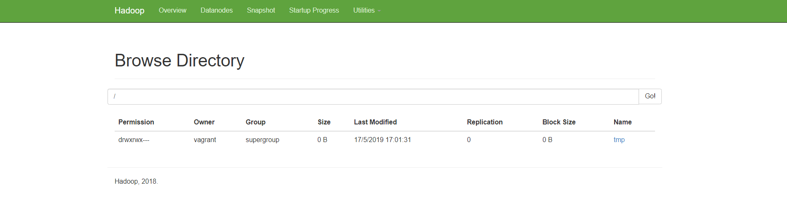
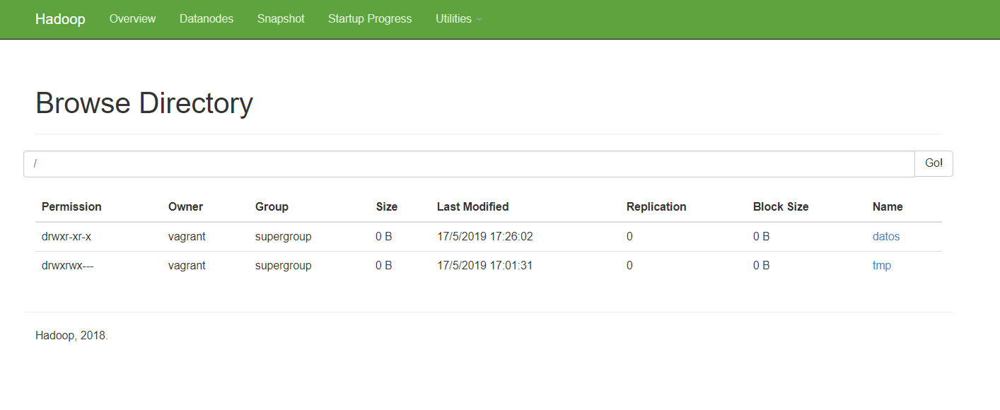
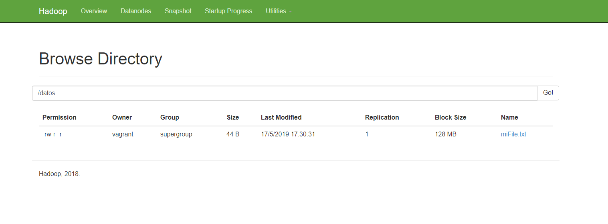

Trabajar con HDFS
===

- Leer Más 
    * [HDFS](./5-Practicas-BigData-trabajar-hdfs.pdf)
    * [HDFS Admin](./6Practicas-BigData-HDFS-admin.pdf)
    
Comando hdfs dfs
---
- Este comando permite trabajar con los ficheros de HDFS.  
- Casi todas las opciones son similares a los comandos “Linux” hdfs dfs 
- Ejecutar el comando “hdfs dfs”. 


````
Usage: hadoop fs [generic options]
        [-appendToFile <localsrc> ... <dst>]
        [-cat [-ignoreCrc] <src> ...]
        [-checksum <src> ...]
        [-chgrp [-R] GROUP PATH...]
        [-chmod [-R] <MODE[,MODE]... | OCTALMODE> PATH...]
        [-chown [-R] [OWNER][:[GROUP]] PATH...]
        [-copyFromLocal [-f] [-p] [-l] <localsrc> ... <dst>]
        [-copyToLocal [-p] [-ignoreCrc] [-crc] <src> ... <localdst>]
        [-count [-q] [-h] <path> ...]
        [-cp [-f] [-p | -p[topax]] <src> ... <dst>]
        [-createSnapshot <snapshotDir> [<snapshotName>]]
        [-deleteSnapshot <snapshotDir> <snapshotName>]
        [-df [-h] [<path> ...]]
        [-du [-s] [-h] <path> ...]
        [-expunge]
        [-find <path> ... <expression> ...]
        [-get [-p] [-ignoreCrc] [-crc] <src> ... <localdst>]
        [-getfacl [-R] <path>]
        [-getfattr [-R] {-n name | -d} [-e en] <path>]
        [-getmerge [-nl] <src> <localdst>]
        [-help [cmd ...]]
        [-ls [-d] [-h] [-R] [<path> ...]]
        [-mkdir [-p] <path> ...]
        [-moveFromLocal <localsrc> ... <dst>]
        [-moveToLocal <src> <localdst>]
        [-mv <src> ... <dst>]
        [-put [-f] [-p] [-l] <localsrc> ... <dst>]
        [-renameSnapshot <snapshotDir> <oldName> <newName>]
        [-rm [-f] [-r|-R] [-skipTrash] <src> ...]
        [-rmdir [--ignore-fail-on-non-empty] <dir> ...]
        [-setfacl [-R] [{-b|-k} {-m|-x <acl_spec>} <path>]|[--set <acl_spec> <path>]]
        [-setfattr {-n name [-v value] | -x name} <path>]
        [-setrep [-R] [-w] <rep> <path> ...]
        [-stat [format] <path> ...]
        [-tail [-f] <file>]
        [-test -[defsz] <path>]
        [-text [-ignoreCrc] <src> ...]
        [-touchz <path> ...]
        [-truncate [-w] <length> <path> ...]
        [-usage [cmd ...]]

Generic options supported are
-conf <configuration file>     specify an application configuration file
-D <property=value>            use value for given property
-fs <local|namenode:port>      specify a namenode
-jt <local|resourcemanager:port>    specify a ResourceManager
-files <comma separated list of files>    specify comma separated files to be copied to the map reduce cluster
-libjars <comma separated list of jars>    specify comma separated jar files to include in the classpath.
-archives <comma separated list of archives>    specify comma separated archives to be unarchived on the compute machines.

The general command line syntax is
bin/hadoop command [genericOptions] [commandOptions]

````
Vamos a ver el contenido de nuestro HDFS.  
En principio debe estar vacío hdfs dfs -ls / 

También podemos ver que está vacío desde la pestaña de utilidades del planel de administracion de Hadoop


- Creamos un nuevo directorio

Vamos a crear un nuevo directorio ``hdfs dfs -mkdir /datos``
 
Comprobar que existe 

    ````   
    hdfs dfs -ls / 
    Found 1 items 
    drwxr-xr-x   - hadoop supergroup          0 2018-01-06 18:31 /datos 
    ````


Y subimos un fichero que generamos manualmenete

````
[vagrant@localhost ~]$ echo "Esto es la prueba de la carga de un fichero" > miFile.txt
[vagrant@localhost ~]$ ls -l
total 211672
-rw-rw-r--. 1 vagrant vagrant 216745683 May 17 14:52 hadoop-2.7.6.tar.gz
-rw-rw-r--. 1 vagrant vagrant        44 May 17 15:29 miFile.txt
drwxr-xr-x. 2 vagrant vagrant         6 May 17 14:53 source
````

Y cargamos el fichero en hdfs

````
[vagrant@localhost ~]$ hdfs dfs -put miFile.txt  /datos
````



Otros Comandos
---
- Comprobar su existencia 

````
hdfs dfs -ls /datos 
Found 1 items 
-rw-r--r--   1 hadoop supergroup         19 2018-01-06 18:34 /datos/miFile.txt• 
```` 
También podemos verlo en la página web. Podemos comprobar el tipo de replicación que tiene y el tamaño correspondiente. 

- Visualizar su contenido 
```
hdf df -cat /datos/miFile.txt
Esto es la prueba de la carga de un fichero 

```


