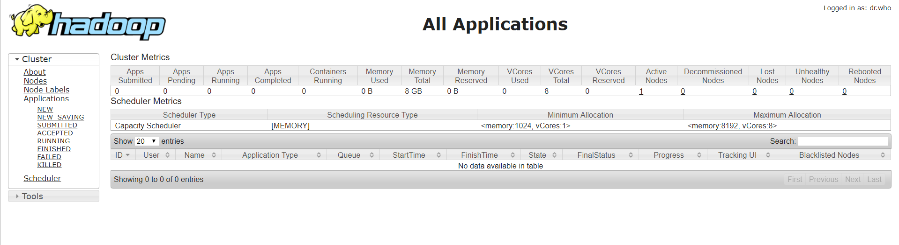
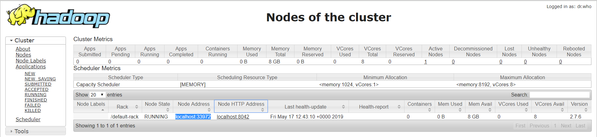

YARN
===
Procesos que existen dentro de YARN 
Supon 1 Master 3 Childs
Resource Manager => Gestor de recursos y por tanto de YARN (Ubicado en el master)
	Scheduler  (Define como se planifican los trabajos)
		Capacity(pl)
	App Manager - Arranca un App Master para que se encargue de la app en un master
	Security

En cada Nodo Hijo Existe un Node Manager, Se solicita al AppManager que se incie un App Master que será un coordinador que se encargará de su app. Este Master, de acuerdo con el scheduler inica los container (por ejemplo un mapper en MapReduce)

Este app Master determinará en que nodo se ejecuta cada contenedor, Cada proceso deberá acceder a su fichero en local.

Montar Yarn en nuestro cluster
===
-  Para montar una template necesitamos modificar los ficheros de yarn-reduce y la template del mapreduce. Este es una template porque no siempre es necesario. En nuestro caso vamos a incluir los ficheros

	- ./yarn-site.xml
	- ./mapred-site.xml

en /yarn-site.xml
Quien es el maestro del yarn
	<property>
		<name>yarn.resourcemanager.hostname</name>
		<value>localhost</value>
	</property>
Como es la gestion
	<property>
	<name>yarn.nodemanager.aux-services</name>
	<value>mapreduce_shuffle</value>
	</property>

Y cual esl clase para realizar esa gestión
	<property>
	<name>yarn.nodemanager.aux-services
	.mapreduce_shuffle.class</name>
	<value>org.apache.hadoop.mapred.ShuffleHandler</value>
	</property>


mapreduce-site
===

<name>mapreduce.framework.name</name>
<value>yarn</value>

Arranque
===
1.- Start hdfs

2.- Start yarn
		Resource Manager
		Node Manager

		El application Manager no aparecerá hasta que no tengamos una applicación....

Web de Administración de Yarn
===
Nos da información de las métricas del cluster.

http://localhost:8088/cluster/apps

En este caso sólo tendremos acceso a un único Nodo. Para poder acceder aé debiéramos incluir los puertos en el fichero Vagrantfile



Si accedemos a al configuración del Nodo por el puerto 8042, vemos la información general del Nodo en el que me estoy conectado.
Información del nodo, aplicaciones ejecutadas sobre el nodo, y sus contenedores, que son los recursos reales ejecutados para realizar los procesos.


hdfs dfs -put /home/hadoop/Descargas/quijote.txt /practicas 
````
Usage: hdfs [--config confdir] [--loglevel loglevel] COMMAND
       where COMMAND is one of:
  dfs                  run a filesystem command on the file systems supported in Hadoop.
  classpath            prints the classpath
  namenode -format     format the DFS filesystem
  secondarynamenode    run the DFS secondary namenode
  namenode             run the DFS namenode
  journalnode          run the DFS journalnode
  zkfc                 run the ZK Failover Controller daemon
  datanode             run a DFS datanode
  dfsadmin             run a DFS admin client
  haadmin              run a DFS HA admin client
  fsck                 run a DFS filesystem checking utility
  balancer             run a cluster balancing utility
  jmxget               get JMX exported values from NameNode or DataNode.
  mover                run a utility to move block replicas across
                       storage types
  oiv                  apply the offline fsimage viewer to an fsimage
  oiv_legacy           apply the offline fsimage viewer to an legacy fsimage
  oev                  apply the offline edits viewer to an edits file
  fetchdt              fetch a delegation token from the NameNode
  getconf              get config values from configuration
  groups               get the groups which users belong to
  snapshotDiff         diff two snapshots of a directory or diff the
                       current directory contents with a snapshot
  lsSnapshottableDir   list all snapshottable dirs owned by the current user
                                                Use -help to see options
  portmap              run a portmap service
  nfs3                 run an NFS version 3 gateway
  cacheadmin           configure the HDFS cache
  crypto               configure HDFS encryption zones
  storagepolicies      list/get/set block storage policies
  version              print the version
````

Práctica: YARN Y MapReduce
===

- Read more [8-Practicas-BigData-YAR](./8-Practicas-BigData-YARN.pdf)
- Read more [9-Practicas-BigData-MapReduce](./9-Practicas-BigData-MapReduce.pdf)


Vamos a procesar un fichero. Para ello, vamos a crear una nueva estructura temporal de información

```` 
[vagrant@localhost ~]$ hdfs dfs -mkdir /practicas
[vagrant@localhost ~]$ hdfs dfs -ls /
Found 3 items
drwxr-xr-x   - vagrant supergroup          0 2019-05-17 15:30 /datos
drwxr-xr-x   - vagrant supergroup          0 2019-05-17 15:46 /practicas
drwxrwx---   - vagrant supergroup          0 2019-05-17 15:01 /tmp
````

Una vez creada la estructura, vamos a subir un fichero a la carpeta prácticas que despues procesaremos

````
[vagrant@localhost vagrant]$ hdfs dfs -put quijote.txt /practicas
[vagrant@localhost vagrant]$ hdfs dfs -ls /
Found 3 items
drwxr-xr-x   - vagrant supergroup          0 2019-05-17 15:30 /datos
drwxr-xr-x   - vagrant supergroup          0 2019-05-17 15:48 /practicas
drwxrwx---   - vagrant supergroup          0 2019-05-17 15:01 /tmp
[vagrant@localhost vagrant]$ hdfs dfs -ls /practicas
Found 1 items
-rw-r--r--   1 vagrant supergroup    2198927 2019-05-17 15:48 /practicas/quijote.txt
[vagrant@localhost vagrant]$
````

Lanzamos el wordcount contra el fichero. Indicamos el directorio de salida donde dejar el resultado, en este caso en /practicas/resultado (siempre en HDFS) 

````
    [vagrant@localhost vagrant]$ hadoop jar /opt/hadoop-2.7.6/share/hadoop/mapreduce/hadoop-mapreduce-examples-2.7.6.jar wordcount /practicas/quijote.txt /practicas/resultado
    19/05/17 15:52:30 INFO Configuration.deprecation: session.id is deprecated. Instead, use dfs.metrics.session-id
    19/05/17 15:52:30 INFO jvm.JvmMetrics: Initializing JVM Metrics with processName=JobTracker, sessionId=
    19/05/17 15:52:31 INFO input.FileInputFormat: Total input paths to process : 1
    19/05/17 15:52:31 INFO mapreduce.JobSubmitter: number of splits:1
    19/05/17 15:52:31 INFO mapreduce.JobSubmitter: Submitting tokens for job: job_local1939943828_0001
    19/05/17 15:52:31 INFO mapreduce.Job: The url to track the job: http://localhost:8080/
    19/05/17 15:52:31 INFO mapreduce.Job: Running job: job_local1939943828_0001
    19/05/17 15:52:31 INFO mapred.LocalJobRunner: OutputCommitter set in config null
    19/05/17 15:52:31 INFO output.FileOutputCommitter: File Output Committer Algorithm version is 1
    19/05/17 15:52:31 INFO mapred.LocalJobRunner: OutputCommitter is org.apache.hadoop.mapreduce.lib.output.FileOutputCommitter
    19/05/17 15:52:31 INFO mapred.LocalJobRunner: Waiting for map tasks
    19/05/17 15:52:31 INFO mapred.LocalJobRunner: Starting task: attempt_local1939943828_0001_m_000000_0
    19/05/17 15:52:31 INFO output.FileOutputCommitter: File Output Committer Algorithm version is 1
    19/05/17 15:52:32 INFO mapred.Task:  Using ResourceCalculatorProcessTree : [ ]
    19/05/17 15:52:32 INFO mapred.MapTask: Processing split: hdfs://nodo1:9000/practicas/quijote.txt:0+2198927
    19/05/17 15:52:32 INFO mapred.MapTask: (EQUATOR) 0 kvi 26214396(104857584)
    19/05/17 15:52:32 INFO mapred.MapTask: mapreduce.task.io.sort.mb: 100
    19/05/17 15:52:32 INFO mapred.MapTask: soft limit at 83886080
    19/05/17 15:52:32 INFO mapred.MapTask: bufstart = 0; bufvoid = 104857600
    19/05/17 15:52:32 INFO mapred.MapTask: kvstart = 26214396; length = 6553600
    19/05/17 15:52:32 INFO mapred.MapTask: Map output collector class = org.apache.hadoop.mapred.MapTask$MapOutputBuffer
    19/05/17 15:52:32 INFO input.LineRecordReader: Found UTF-8 BOM and skipped it
    19/05/17 15:52:32 INFO mapreduce.Job: Job job_local1939943828_0001 running in uber mode : false
    19/05/17 15:52:32 INFO mapreduce.Job:  map 0% reduce 0%
    19/05/17 15:52:33 INFO mapred.LocalJobRunner:
    19/05/17 15:52:33 INFO mapred.MapTask: Starting flush of map output
    19/05/17 15:52:33 INFO mapred.MapTask: Spilling map output
    19/05/17 15:52:33 INFO mapred.MapTask: bufstart = 0; bufend = 3688599; bufvoid = 104857600
    19/05/17 15:52:33 INFO mapred.MapTask: kvstart = 26214396(104857584); kvend = 24677360(98709440); length = 1537037/6553600
    19/05/17 15:52:34 INFO mapred.MapTask: Finished spill 0
    19/05/17 15:52:34 INFO mapred.Task: Task:attempt_local1939943828_0001_m_000000_0 is done. And is in the process of committing
    19/05/17 15:52:34 INFO mapred.LocalJobRunner: map
    19/05/17 15:52:34 INFO mapred.Task: Task 'attempt_local1939943828_0001_m_000000_0' done.
    19/05/17 15:52:34 INFO mapred.Task: Final Counters for attempt_local1939943828_0001_m_000000_0: Counters: 23
            File System Counters
                    FILE: Number of bytes read=295994
                    FILE: Number of bytes written=1199849
                    FILE: Number of read operations=0
                    FILE: Number of large read operations=0
                    FILE: Number of write operations=0
                    HDFS: Number of bytes read=2198927
                    HDFS: Number of bytes written=0
                    HDFS: Number of read operations=5
                    HDFS: Number of large read operations=0
                    HDFS: Number of write operations=1
            Map-Reduce Framework
                    Map input records=37861
                    Map output records=384260
                    Map output bytes=3688599
                    Map output materialized bytes=605509
                    Input split bytes=104
                    Combine input records=384260
                    Combine output records=40059
                    Spilled Records=40059
                    Failed Shuffles=0
                    Merged Map outputs=0
                    GC time elapsed (ms)=25
                    Total committed heap usage (bytes)=270532608
            File Input Format Counters
                    Bytes Read=2198927
    19/05/17 15:52:34 INFO mapred.LocalJobRunner: Finishing task: attempt_local1939943828_0001_m_000000_0
    19/05/17 15:52:34 INFO mapred.LocalJobRunner: map task executor complete.
    19/05/17 15:52:34 INFO mapred.LocalJobRunner: Waiting for reduce tasks
    19/05/17 15:52:34 INFO mapred.LocalJobRunner: Starting task: attempt_local1939943828_0001_r_000000_0
    19/05/17 15:52:34 INFO output.FileOutputCommitter: File Output Committer Algorithm version is 1
    19/05/17 15:52:34 INFO mapred.Task:  Using ResourceCalculatorProcessTree : [ ]
    19/05/17 15:52:34 INFO mapred.ReduceTask: Using ShuffleConsumerPlugin: org.apache.hadoop.mapreduce.task.reduce.Shuffle@70b7fbe8
    19/05/17 15:52:34 INFO reduce.MergeManagerImpl: MergerManager: memoryLimit=334338464, maxSingleShuffleLimit=83584616, mergeThreshold=220663392, ioSortFactor=10, memToMemMergeOutputsThreshold=10
    19/05/17 15:52:34 INFO reduce.EventFetcher: attempt_local1939943828_0001_r_000000_0 Thread started: EventFetcher for fetching Map Completion Events
    19/05/17 15:52:34 INFO reduce.LocalFetcher: localfetcher#1 about to shuffle output of map attempt_local1939943828_0001_m_000000_0 decomp: 605505 len: 605509 to MEMORY
    19/05/17 15:52:34 INFO reduce.InMemoryMapOutput: Read 605505 bytes from map-output for attempt_local1939943828_0001_m_000000_0
    19/05/17 15:52:34 WARN io.ReadaheadPool: Failed readahead on ifile
    EBADF: Bad file descriptor
            at org.apache.hadoop.io.nativeio.NativeIO$POSIX.posix_fadvise(Native Method)
            at org.apache.hadoop.io.nativeio.NativeIO$POSIX.posixFadviseIfPossible(NativeIO.java:267)
            at org.apache.hadoop.io.nativeio.NativeIO$POSIX$CacheManipulator.posixFadviseIfPossible(NativeIO.java:146)
            at org.apache.hadoop.io.ReadaheadPool$ReadaheadRequestImpl.run(ReadaheadPool.java:206)
            at java.util.concurrent.ThreadPoolExecutor.runWorker(ThreadPoolExecutor.java:1149)
            at java.util.concurrent.ThreadPoolExecutor$Worker.run(ThreadPoolExecutor.java:624)
            at java.lang.Thread.run(Thread.java:748)
    19/05/17 15:52:34 INFO reduce.MergeManagerImpl: closeInMemoryFile -> map-output of size: 605505, inMemoryMapOutputs.size() -> 1, commitMemory -> 0, usedMemory ->605505
    19/05/17 15:52:34 INFO reduce.EventFetcher: EventFetcher is interrupted.. Returning
    19/05/17 15:52:34 INFO mapred.LocalJobRunner: 1 / 1 copied.
    19/05/17 15:52:34 INFO reduce.MergeManagerImpl: finalMerge called with 1 in-memory map-outputs and 0 on-disk map-outputs
    19/05/17 15:52:34 INFO mapred.Merger: Merging 1 sorted segments
    19/05/17 15:52:34 INFO mapred.Merger: Down to the last merge-pass, with 1 segments left of total size: 605498 bytes
    19/05/17 15:52:34 INFO reduce.MergeManagerImpl: Merged 1 segments, 605505 bytes to disk to satisfy reduce memory limit
    19/05/17 15:52:34 INFO reduce.MergeManagerImpl: Merging 1 files, 605509 bytes from disk
    19/05/17 15:52:34 INFO reduce.MergeManagerImpl: Merging 0 segments, 0 bytes from memory into reduce
    19/05/17 15:52:34 INFO mapred.Merger: Merging 1 sorted segments
    19/05/17 15:52:34 INFO mapred.Merger: Down to the last merge-pass, with 1 segments left of total size: 605498 bytes
    19/05/17 15:52:34 INFO mapred.LocalJobRunner: 1 / 1 copied.
    19/05/17 15:52:34 INFO Configuration.deprecation: mapred.skip.on is deprecated. Instead, use mapreduce.job.skiprecords
    19/05/17 15:52:34 INFO mapreduce.Job:  map 100% reduce 0%
    19/05/17 15:52:35 INFO mapred.Task: Task:attempt_local1939943828_0001_r_000000_0 is done. And is in the process of committing
    19/05/17 15:52:35 INFO mapred.LocalJobRunner: 1 / 1 copied.
    19/05/17 15:52:35 INFO mapred.Task: Task attempt_local1939943828_0001_r_000000_0 is allowed to commit now
    19/05/17 15:52:35 INFO output.FileOutputCommitter: Saved output of task 'attempt_local1939943828_0001_r_000000_0' to hdfs://nodo1:9000/practicas/resultado/_temporary/0/task_local1939943828_0001_r_000000
    19/05/17 15:52:35 INFO mapred.LocalJobRunner: reduce > reduce
    19/05/17 15:52:35 INFO mapred.Task: Task 'attempt_local1939943828_0001_r_000000_0' done.
    19/05/17 15:52:35 INFO mapred.Task: Final Counters for attempt_local1939943828_0001_r_000000_0: Counters: 29
            File System Counters
                    FILE: Number of bytes read=1507044
                    FILE: Number of bytes written=1805358
                    FILE: Number of read operations=0
                    FILE: Number of large read operations=0
                    FILE: Number of write operations=0
                    HDFS: Number of bytes read=2198927
                    HDFS: Number of bytes written=448894
                    HDFS: Number of read operations=8
                    HDFS: Number of large read operations=0
                    HDFS: Number of write operations=3
            Map-Reduce Framework
                    Combine input records=0
                    Combine output records=0
                    Reduce input groups=40059
                    Reduce shuffle bytes=605509
                    Reduce input records=40059
                    Reduce output records=40059
                    Spilled Records=40059
                    Shuffled Maps =1
                    Failed Shuffles=0
                    Merged Map outputs=1
                    GC time elapsed (ms)=23
                    Total committed heap usage (bytes)=304087040
            Shuffle Errors
                    BAD_ID=0
                    CONNECTION=0
                    IO_ERROR=0
                    WRONG_LENGTH=0
                    WRONG_MAP=0
                    WRONG_REDUCE=0
            File Output Format Counters
                    Bytes Written=448894
    19/05/17 15:52:35 INFO mapred.LocalJobRunner: Finishing task: attempt_local1939943828_0001_r_000000_0
    19/05/17 15:52:35 INFO mapred.LocalJobRunner: reduce task executor complete.
    19/05/17 15:52:35 INFO mapreduce.Job:  map 100% reduce 100%
    19/05/17 15:52:35 INFO mapreduce.Job: Job job_local1939943828_0001 completed successfully
    19/05/17 15:52:35 INFO mapreduce.Job: Counters: 35
            File System Counters
                    FILE: Number of bytes read=1803038
                    FILE: Number of bytes written=3005207
                    FILE: Number of read operations=0
                    FILE: Number of large read operations=0
                    FILE: Number of write operations=0
                    HDFS: Number of bytes read=4397854
                    HDFS: Number of bytes written=448894
                    HDFS: Number of read operations=13
                    HDFS: Number of large read operations=0
                    HDFS: Number of write operations=4
            Map-Reduce Framework
                    Map input records=37861
                    Map output records=384260
                    Map output bytes=3688599
                    Map output materialized bytes=605509
                    Input split bytes=104
                    Combine input records=384260
                    Combine output records=40059
                    Reduce input groups=40059
                    Reduce shuffle bytes=605509
                    Reduce input records=40059
                    Reduce output records=40059
                    Spilled Records=80118
                    Shuffled Maps =1
                    Failed Shuffles=0
                    Merged Map outputs=1
                    GC time elapsed (ms)=48
                    Total committed heap usage (bytes)=574619648
            Shuffle Errors
                    BAD_ID=0
                    CONNECTION=0
                    IO_ERROR=0
                    WRONG_LENGTH=0
                    WRONG_MAP=0
                    WRONG_REDUCE=0
            File Input Format Counters
                    Bytes Read=2198927
            File Output Format Counters
                    Bytes Written=448894
```` 

Podemos ver el contenido del resultado tanto desde la Web de administracion como desde a linea de comandos

```
hdfs dfs -ls /practicas/resultado
 Found 2 items 
 -rw-r--r--   1 hadoop supergroup          0 2018-01-06 19:29 /practicas/resultado/_SUCCESS 
 -rw-r--r--   1 hadoop supergroup     448894 2018-01-06 19:29 /practicas/resultado/part-r-00000 
```

